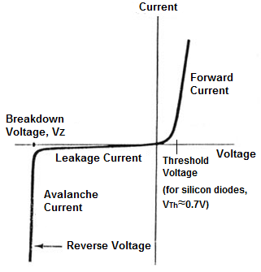
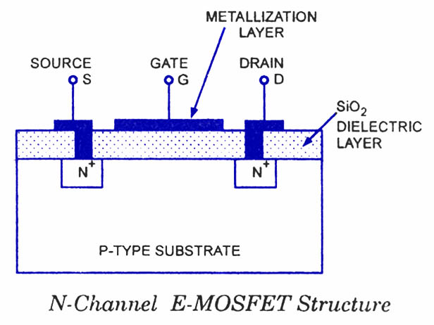
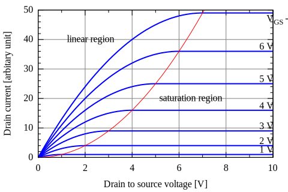
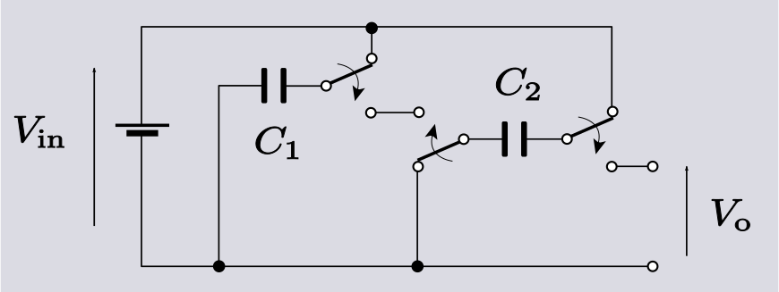
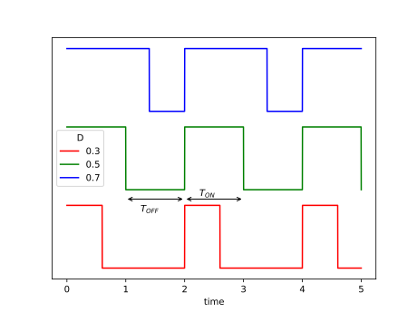

# Oxhack Analog Electronics
-------
## Session 3 - Boost Converter

---

## Before we start

* This isn't comprehensive - if you're interested buy AoE or do online tutorials
* This isn't intended to explain the physics (though ask me if you're interested)
* __NEVER__ build your own SMPS from scratch, this is just a concept demonstrator, IRL use pre-built chips and read the datasheet carefully
* There is a lot to take in here, don't worry if you don't understand immediately

---

## Recap

* Electrons
* Voltage & Current
* Kirchoff's laws
* Resistors
* Capacitors

----

### Electrons

* Electricity is the flow of electrons
* Two important properties: __charge__ and __energy__
* __Charge__ of an electron is fixed and _never changes_
* __Energy__ of an electron changes through interaction with circuit elements

----

### Voltage & Current

__Current:__
The amount of charge (i.e. number of electrons) passing a point per unit time.

$I = {{dQ}\over{dt}} $

__Voltage:__
The average difference in energy between electrons at two points

__Ground:__
A common (but arbitrary) voltage reference point for a circuit, chosen to have 0 energy.

----

### Kirchoff's Laws 1

1) Current at a node adds up to 0 (electrons can't be created or destroyed)

----

### Kirchoff's Laws 2

2) Voltage around a loop adds up to 0 (energy change must all be accounted for)

----

### Resistors

Dissipate energy as heat

$V=I\times R$

Useful for converting current into voltage (or vice versa), defining ratios of voltage drops, limiting current into other devices

----

### capacitors

Store energy temporarily by separating charge in an electric field.

$Q=C \times V$

$\Rightarrow I = C \times {dV \over dt}$

Respond to the _rate of change_ of voltage, not the voltage itself
Useful for filtering, smoothing, short term storage of a voltage

---

## Magnetic Flux

$ V = {d\Phi \over dt}  \quad \mathrm{c.f.} \quad I = {dQ \over dt}$

$ \Phi = \int V dt  $

A quantity which is to magnetic circuits as charge is to electrical circuits.
Important in designing transformers, microwave electronics etc.

Don't worry too much about it for now (here for completeness)...

----

## Inductors

Store energy temporarily by creating current loops in a magnetic field

$ \Phi = L \times I $

$ \Rightarrow V = L \times {dI \over dt} $

Useful in: filtering, resonant circuits, switched mode power supplies, making sparks

---

## Diodes

- Using a semiconductor junction, make it much easier for electrons to flow in one direction than the other

- As electrons cross the junction they lose energy either to heat or photon emission

- The first non-linear and asymmetric device we have encountered

Useful in: rectification, protection circuits, voltage references, non-linear circuits,etc...

----

$ I = I_S \left( e^{V \over {n V\_t} } - 1 \right) $

$ V_t = {q\_e \over {k\_B T} } \approx 26 \mathrm{mV}   $ @ 298K (room temp)

For an "ideal" diode, $ n = 1 $

----

### Diode Types

- Some specialized constructions of diodes are used for specific applications.
- Today we will use: Schottky diode & LED

----

### Diode General Points

- 'A' for Anode and 'K' for Cathode
- Current flows easily from A to K, but not from K to A
- voltage higher on A than K - "forward biased"
- voltage higher on K than A - "reverse biased"
- __if you forward bias a diode, always know what limits the current__ (without any current limiting, a forward biased diode will destroy itself)
- __if you reverse bias a diode, always know what you're doing in general__ (perhaps in another session ;-) )

---

## MOSFET

**M**etal **O**xide **S**emiconductor **F**ield **E**ffect **T**ransistor

----

* One of the most common transistor types in use today (the other being the BJT)
* Extremely rich semiconductor physics
* Can be used as an amplifier, a voltage controlled switch, a variable capacitor ...
* Insulated gate means no current used by the gate drive (unlike BJT)

__We will likely do a whole session on transistor types, today we are just going to use switching mode__

----

## MOSFET Types

* MOSFETs can be made in "n-channel" or "p-channel" (both equally common) and in "enhancement mode" or "depletion mode". 
* Each type works slightly differently. Today we are using an n-channel enhancement mode MOSFET, the 2N7000.
* **Take care handling** : MOSFETS are _very_ powerful and useful devices which can handle high voltages & currents, but the gate connection is physically fragile: static discharge will destroy it very easily. 

----

* Terminals are "Drain (D)", "Gate (G)" and "Source (S)"
* arrow points to/from the source
* Gate is drawn on the Source side
* arrow direction indicates p or n type, remember "N goes IN"

----

### MOSFET Characteristics

* Current through MOSFET depends on $V\_{DS}$ and $V\_{GS}$
* For n-channel enhancement type, increasing $V\_{GS}$ or $V\_{DS}$ increases current
* __look at 2N7000 datasheet to see characteristics__

----

**Subthreshold**  ($V\_{GS} < V\_{th} $) :

$I\_D = K \exp\left( {V\_{GS} - V\_{th} \over nV\_T} \right)$

**Linear Region**  ($V\_{GS} > V\_{th};  V\_{DS} \leq \left(V\_{GS} - V\_{th} \right)$ ) :

$I\_D = K \left( \left(V\_{GS} - V\_{th}\right)V\_{DS} - {V\_{DS}^2 \over 2} \right)$

**Active Region**  ($V\_{GS} > V\_{th};  V\_{DS} > \left(V\_{GS} - V\_{th} \right)$ ):

$I\_D = {K \over 2} \left(V\_{GS} - V\_{th}\right)^2 \left(1+\lambda\left(V\_{DS} - V\_{DSsat}\right)\right)$

---

## Power

$ P = V \times I $

$ P = {E \over Q} \times {Q \over t} = {E \over t} $

The rate of energy use by a load

----

## Efficiency

$ P\_{out} = \eta P\_{in} $

$ \eta \leq 1$ 

**CONSEQUENCE:** if you want higher voltage out than you put in, you must put more current in than you want out!

----

## Power Supply Types

* Transformer

* Linear Regulator

* Charge Pump

* Switch Mode

----

### Transformer

* AC to AC only 

* Simple: Ratio of input to output voltage is ratio of number of turns
$ {V\_P \over V\_S} = {N\_P \over N\_S} $

* Can be highly efficient, handle very high voltage & current

* Heavy, costly, require AC and can introduce EMI issues

----

### Linear Regulator

* Convert higher DC voltage into lower DC voltage (can't increase voltage)

* low cost, simple to use

* low efficiency - efficiency depends on voltage ratio:
$ \eta \approx {V\_{out} \over V\_{in}} $

* very good noise and ripple performance

__if people are interested, we will build one in a future session__

----

### Charge Pump (aka inductorless SMPS)

* DC to DC conversion - usually boost, but can also buck and even invert!

By Courtesy Spinningspark at Wikipedia, CC BY-SA 3.0

* Most suitable for low current , high noise and ripple

__if people are interested, we will build one in a future session__

---

### Switch Mode Power Supply (SMPS)

* DC to DC conversion using switched inductor. Can be configured as buck (lower output voltage), boost (higher output voltage) or buck-boost (variable)

* highly efficient ($\eta \geq 0.8 $ )

* Low cost & size

* Requires complicated digital circuitry to perform regulation

---

## Volt Second Balance

- If you apply a DC voltage across an inductor, it __will__ melt something (either itself or the power supply)

- Therefore, using an inductor in steady state requires that it achieve __volt second balance__

- The average voltage change over one cycle of operation __must be zero__

- This is the basic principle of much of SMPS design

----

## Boost Converter

- switch connected to ground: current ramps up through the inductor. Load is supplied by the capacitor

- switch  connected to output: sudden change in current causes inductor to develop a high voltage, current flows into capacitor which charges

----

## Practical Implementation

- Using all the components we looked at today!
- Take some time to try and understand the concept

----

## Control Signal

- We define the quantity "Duty Cycle" (D) to be:
  $ D = {T\_{ON} \over {T\_{ON} + T\_{OFF}}} $

----

Applying the volt-second balance principle (and neglecting losses in diode & transistor):
	$ V\_{in} \times T\_{ON} = \left(V\_{OUT} - V\_{IN}\right)\times T\_{OFF} $
	$ \Rightarrow {V\_{OUT} \over V\_{IN}} = {T\_{ON} + T\_{OFF} \over T\_{OFF}} $

   $ \Rightarrow {V\_{OUT} \over V\_{IN}} = {1 \over {1 - D}} $

Including inefficiency, the result is:

$ D = 1 - \eta {V\_{IN} \over V\_{OUT}} $

---

# Practical

Follow instructions on schematic.

This is the first time we've dealt with anything that is remotely likely to smoke or shock you, so:

__If in doubt ask__
	

---

### Useful Links

https://artofelectronics.net

[https://github.com/weatherhead99/oxhack\_analog\_electronics](https://github.com/weatherhead99/oxhack\_analog\_electronics)
