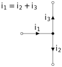
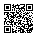
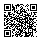

# Oxhack Analog Electronics
-------
## Session 2 - Op amps

---

## Recap

* Electrons
* Voltage & Current
* Kirchoff's laws
* Resistors
* Capacitors

----

### Electrons

* Electricity is the flow of electrons
* Two important properties: __charge__ and __energy__
* __Charge__ of an electron is fixed and _never changes_
* __Energy__ of an electron changes through interaction with circuit elements

----

### Voltage & Current

__Current:__
The amount of charge (i.e. number of electrons) passing a point per unit time.

$I = {{dQ}\over{dt}} $

__Voltage:__
The average difference in energy between electrons at two points

__Ground:__
A common (but arbitrary) voltage reference point for a circuit, chosen to have 0 energy.

----

### Kirchoff's Laws 1

1) Current at a node adds up to 0 (electrons can't be created or destroyed)

----

### Kirchoff's Laws 2

2) Voltage around a loop adds up to 0 (energy change must all be accounted for)

----

### Resistors

Dissipate energy as heat

$V=I\times R$

Useful for converting current into voltage (or vice versa), defining ratios of voltage drops, limiting current into other devices

----

### capacitors

Store energy temporarily by separating charge in an electric field.

$Q=c \times V$

$\Rightarrow I = c \times {dV \over dt}$

Respond to the _rate of change_ of voltage, not the voltage itself
Useful for filtering, smoothing, short term storage of a voltage

---

## Operational Amplifiers

* versatile analog components that can be configured to perform various mathematical operations on a signal

* internally complicated objects (at least 4 transistors) 

* Being able to use and understand resistors, capacitors and op-amps enables you to access a very large number of analog circuit designs.

----

## Op amp connections

* Non-inverting (+) and inverting(-) inputs
* output
* power supply rails

**Be careful: inverting and non-inverting inputs can be drawn either way round!**

----

## Basic Theory 

Op amps use external power (from a power supply) to adjust their voltage output such that it is an amplification of the difference between their inputs

$ V\_{out} = A \times \left( V\_+  -V\_-  \right)$

$A$ is called "open loop gain", and in an ideal op-amp, it is infinite. Real world values can be up to $A\approx10^6$

----

## Design Rule

Since open loop gain is infinite, in most cases we use _negative feedback_ to cancel out almost all the difference between the inverting and non-inverting terminals. This leads to a simplified design rule for ideal op amp circuits:

__Always have negative feedback from the output ($V\_{out}$) to the inverting input ($V\_-$)__

----

## Golden Rules

Generally, ideal op amp circuits can be analysed using the two "golden rules" of op amps:

1) Assume $V\_+ = V\_-$

2) Assume the inputs draw no current
	
For this session we will build various ideal op amp circuits and analyse them using these rules

----

# Derivation for inverting op amp

Feel free to go for a coffee if you don't want to sit through the maths!

---

# Practical

Choose a couple of op amp circuits from the example sheet and construct them - test using signal generator inputs and/or the microphone modules.

Don't worry if you didn't understand it all - this is a big topic, but once you crack op amps, you understand __a lot__ of analog electronics

Happy hacking

---

### Useful Links

https://artofelectronics.net

[Walter Lewin's MIT 8.02x lectures](https://www.youtube.com/watch?v=rtlJoXxlSFE&list=PLyQSN7X0ro2314mKyUiOILaOC2hk6Pc3j)

[these slides](https://github.com/weatherhead99/oxhack\_analog\_electronics)

