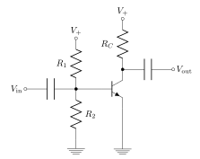
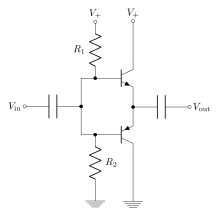
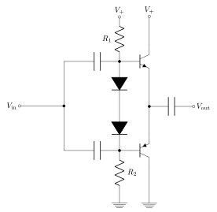

# Oxhack Analog Electronics
-------------
## Session 7 - Power Amplifiers

---

## Before we start

* This isn't comprehensive - if you're interested buy AoE or do online tutorials
* This isn't intended to explain the physics (though ask me if you're interested)
* There is a lot to take in here, don't worry if you don't understand immediately

---

## Recap

* Diodes
* BJTs 
* Power
* Efficiency

----

## Diodes

$ I = I_S \left( e^{V \over {n V\_t} } - 1 \right) $

$ V_t = {q\_e \over {k\_B T} } \approx 26 \mathrm{mV}   $ @ 298K (room temp)

- Note that the equation for diode Vf in a circuit, is not solvable with elementary functions (requires lambert W function).

- Despite this, diode forward voltage drop changes very slowly with current - diodes are often used as voltage "clamps" (show Vf demo)

----

### BJTs (biasing)

For a BJT in "active" (simplified Ebers-Moll model): 

$ I\_E = I\_S \left( e^{V\_{BE} \over V\_T } - 1\right)$

$ I\_C \approx \beta I\_B $

$ I\_E = I\_C + I\_B $

----

### For the masochists:

Full Ebers-Moll model (i.e. not just "active mode"):

$ I\_E = I\_{SS} \left(\left(e^{V\_{BE} \over V\_T}  - e^{V\_{BC} \over V\_T} \right) + {1 \over \beta} \left(e^{V\_{BE} \over V\_T}- 1 \right)   \right) $

- this is the origin of the "saturation" effect

----

## Q point

- Recall that with diodes, whilst there isn't a "true threshold", that in real world terms there is a point where the exponential current increase for small voltage increase becomes "infinite". This is called the "threshold", and is ~0.7V in silicon devices (that is just a rule of thumb - varies with temperature and other things).

- To operate a BJT (or MOSFET for that matter) as an amplifier, must "bias" the base (or gate) such that it is above this level. This is called the Q-point

----

## BJT biasing

- From the Ebers-Moll equation, BJT looks like a voltage controlled device.

- Remember though, that it sinks current through the base to the emitter, just like a diode (it _is_ a diode actually). So, just like any other diode, you must have resistance from the supply to the base, otherwise the BJT will fry itself.

----

## One more point about transistor bias

- A silicon BJT doesn't have a "real" threshold, but does have the same threshold behaviour as a silicon diode, so you can almost always start by assuming the threshold is ~0.7V.

- A MOSFET really _does_ have a threshold, and it can be tuned by device construction from as low as ~0.05V to ~200V. So MOSFETS require careful consideration in biasing.

----

## Transistor types (again)

- The PNP transistor electrically operates "mirror" to the NPN transistor (the arrow on the symbol shows the current direction)

- where the NPN goes active when $V\_{BE} > 0$, the PNP goes active when $V\_{BE} < 0$ 

That covers 90% of the main confusions about NPN and PNP, but there are some other more subtle details (at both the electronics and the physics level).

----

### Power

$ P = V \times I $

$ P = {E \over Q} \times {Q \over t} = {E \over t} $

The rate of energy use by a load

In the case of power amps, often we can substitute "power" by "current", since we normally run around a fixed DC voltage bias.

Devices like headphones & speakers are "power driven", i.e. voltages and currents are not specified, but impedance and power are.

----

### Efficiency 

Recall, for a  power _supply_ :

$ P\_{out} = \eta P\_{in} $

$ \eta \leq 1$ 

Unlike the power supply, "efficiency" today basically means "how much current does the amplifier use when it's not doing anything?"

Amount of current flowing with no signal input is called "quiescent current"

---

## Audio conventions

- This is basically stamp collecting

- It gets really obtuse really fast

- Basically don't worry as long as you have a basic concept you can look it up

----

### deciBels

- Just a way to specify logarithmic quantities (either powers or amplitudes)
It is defined such that 10 dB is a power ratio of 10:

$ 1dB \equiv 10 \log\_{10}\left( {P\_2 \over P\_1} \right) $

- Amplitude is always related to power in a quadratic way, $ P \propto A ^2$, so for amplitudes, a deciBel is defined as:

$ 1dB \equiv 10 \log\_{10}\left( {A\_2^2 \over A\_1^2 } \right) \equiv 20 \log\_{10}\left( {A\_2 \over A\_1} \right)$

---

- aying "1 dB " is technically meaningless, since we don't know whether you're talking about power or amplitude, or what the value of $P\_1$ or $A\_1$ is in the decibel equation. All proper decibel measurements are in units with a suffix which gives them physical meaning:

dB SPL, dB(A), dBm, dBV, dBu, dBFS

There are literally hundreds, and sometimes the same abbreviation is used to mean multiple things in different contexts, because _of course_ they are

----

### dB SPL, dB(A), dB(C)

These refer to actual physical air pressure changes referred to Pascals. dB SPL is the unweighted sound pressure level referred to 1 Pa (i.e. the actual amount of physical sound that you hear). 

dB(A) and dB(C) are the same measurement, but with a frequency dependent weighting applied for whatever reason. The "A" weighting is meant to match human hearing, and the "C" weighting is meant to be basically flat above 100 Hz (why? I don't know).

----

### dbV, dbV(rms)

These are voltages, referenced to $A\_1 = 1 V$. Either peak (dbV), or rms (dbV(rms))

Voltage is an amplitude unit, therefore 10 dBV, means the Voltage has changed by a factor of 3.162 

Not to be confused with dbVU, which means (deciBel Volume Unit), which nobody has ever been able to explain to me what it means. It appears on some old mixing desks etc

----

### dBu, dBv and dBm

dBu, dBv and dBm are all the same unit...

yes, note the difference between dBV and dBv !!!! 

Defined as the power relative to 1mW.
For voltages, we assume a 600$\Omega$ load (this was relevant for ancient telephone systems, but still widely used today).

Since $ P = {V^2 \over R}$ , 1 dBu translates to $\sqrt{ 600 \times 0.001} \approx 0.77 V $ RMS.

Usually the "0" in a professional VU meter is calibrated to +4dBu (nominal line level, see later!)

----

### dBFS

This is relevant for digital systems. It is the amplitude of a signal in a digital system compared to the maximum possible value. E.g., for a 16-bit system, 0dBFS = $ 2^{16} - 1 = 65535 $

Thus, for your audio to work, you must _always_ have levels below 0dBFS to avoid hideous digital clipping

---

## Audio line levels

There are two commonly used "line levels":

- "Pro", defined as nominal +4dBu, (i.e. ~1.2V RMS, 3.5V p2p) 

- "consumer", defined as nominal -10dBV (i.e. ~0.3V RMS, 0.9V p2p)

----

## Audio headphone levels

Normal "ear bud" headphones have roughly 25$\Omega$ impedance, mostly resistance, plus a small amount of inductance. About 5mW of power is "loud" for most cheapish headphones.

Obscure and baroque headphones can range from 12$\Omega$ to 600 $\Omega$. 

Typical speakers are designed to be either 4$\Omega$, 8 $\Omega$ or 16 $\Omega$ regardless of whether they are crappy car boot speakers or massive PA systems. Though the inductance component may vary widely.

---

## Power Amplifiers

- As opposed to "voltage amplifiers" ( e.g. op-amps), power amplifiers are designed to drive a signal into the output with higher power than was delivered into the input. 
- This may (or may not) also involve increasing the signal voltage

- Design power amplifiers with the load impedance in mind, not worrying too much about the voltage level

----

#### Aside - MOSFET vs BJT for amplifiers
Pros for BJT:
	* Higher gain
	* bigger linear/active region
	* higher current capacity for same size device
	* gain doesn't depend on input voltage
	
Pros for MOSFET:
	* super high input impedance
	* better power consumption for same gain
	* better matching

On the whole, I'd recommend a BJT design for your first homebrew power amp. 

----

## Amplifier classes

- "Class" describes the general topology and features of the amplifier. 

- Broadly speaking:
  - "analog type" : classes A, B, AB, C - generally use power transistors in active mode and the "conduction angle" concept
  - "switching type": classes D, E, F, G, S, T ... - generally use power transistors in saturation mode and digital switching circuitry

----

## Class A amplifier

----

## Class A amplifier

- One transistor, which amplifies the whole signal.
- Must always sit at its bias point, therefore always consumes power even when no signal present
- As good as it gets in terms of linearity and distortion

----

## Class B amplifier

----

## Class B amplifier

- complementary pair of transistors
- the NPN only conducts on the "top half" of signals, the PNP only on the "bottom half" 
- theoretically no quiescent power consumption
- Suffers greatly from so-called "crossover distortion" due to the transistors having a threshold

----

## Class AB amplifier 

----

## Class AB amplifier

- Compromise between class A  and class B
- Transistors are biased "just above" the threshold, so during crossover, they both conduct. 
- Diodes act as voltage sources / clamps
- Needs careful adjustment to achieve optimum efficiency
- Ideally, needs carefully matched transistors and diodes (we don't have those today!)

---

## Other considerations

- In practical amplifiers, we also need to think about distortion and working range.
- Today, we will mitigate both of these issues using feedback and an op amp
- (Discussion of the circuit to build and how it works)

---

### Practical

1) Measure Vt of your transistors and Vf of your diodes

2) Build circuit

3) setup biasing

5) play some sounds through loudspeaker & piezo buzzers

6) explore what happens when changing the amplifier feedback point, or removing feedback altogether

---

### options for next session:

 - parametric EQ & filtering?
 
 - PLLs, clocking, frequency multiplying?
 
 - home brew ADC? 
 
 - practical electronics? (e.g. reading datasheets, laying out PCBs etc)
 

---

### Links:

https://artofelectronics.net

[https://github.com/weatherhead99/oxhack\_analog\_electronics](https://github.com/weatherhead99/oxhack\_analog\_electronics)

http://www.electronics-tutorials.ws/

[https://weatherhead99.github.io/oxhack_analog_electronics]
