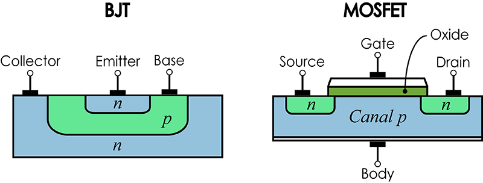
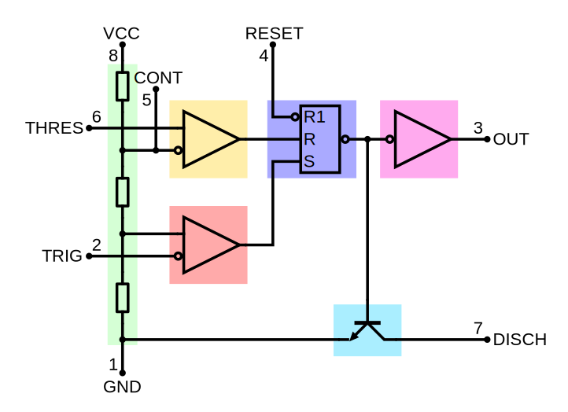

# Oxhack Analog Electronics
----------------
## Session 4 - Relaxation Oscillator

---

## Recap

* Op amps

## New stuff

* BJTs (__VERY__ briefly)
* Comparators
* Oscillator theory

----

## If you missed previous sessions

* Please ask for recap
* Please ask questions
* Please ask for help

## If you are a regular

* Encourage and help others
* Take turns building and debugging

----

## Usual Caveats Apply

* This isn't intended to explain the physics (but ask me if you're interested, I am a semiconductor physicist by training / background)

* This isn't comprehensive - good tutorials on the web, or read AoE

* This is complicated - don't worry if you don't "get it" all at once

---

## Operational Amplifiers

* versatile analog components that can be configured to perform various mathematical operations on a signal

* internally complicated objects (at least 4 transistors) 

* Being able to use and understand resistors, capacitors and op-amps enables you to access a very large number of analog circuit designs.

----

## Op amp connections

* Non-inverting (+) and inverting(-) inputs
* output
* power supply rails

**Be careful: inverting and non-inverting inputs can be drawn either way round!**

----

## Basic Theory 

Op amps use external power (from a power supply) to adjust their voltage output such that it is an amplification of the difference between their inputs

$ V\_{out} = A \times \left( V\_+  -V\_-  \right)$

$A$ is called "open loop gain", and in an ideal op-amp, it is infinite. Real world values can be up to $A\approx10^6$

----

## Design Rule

Since open loop gain is infinite, in most cases we use _negative feedback_ to cancel out almost all the difference between the inverting and non-inverting terminals. This leads to a simplified design rule for ideal op amp circuits:

__Always have negative feedback from the output ($V\_{out}$) to the inverting input ($V\_-$)__

----

## Golden Rules

Generally, ideal op amp circuits can be analysed using the two "golden rules" of op amps:

1) Assume $V\_+ = V\_-$

2) Assume the inputs draw no current
	
For this session we will build various ideal op amp circuits and analyse them using these rules

---

## BJT

**B**ipolar **J**unction **T**ransistor

* Differs from MOSFET we saw previously in construction, physics & detailed operation

----

## BJT Types

* BJTs can be "npn" or "pnp" (which are broadly equivalent to MOSFET "n-channel" & "p-channel". Today we are using an NPN built into the output of a comparator chip.

* Comparison of pros/cons & performance difference with MOSFET is very involved, we will spend most of a session on it another time (probably whilst building a power amp)

----

## BJT connection names

* As with MOSFET, for pnp the "collector" & "emitter" are reversed

----

* In active mode, main difference is:

 MOSFET   

$I\_D = {K \over 2} \left(V\_{GS} - V\_{th}\right)^2 \left(1+\lambda\left(V\_{DS} - V\_{DSsat}\right)\right)$

 BJT 

$I\_E = I\_S \left( e^{V\_{BE} \over V\_T} - 1 \right)$

$I\_C \approx I\_E \approx  \beta I\_B$

BJT sinks current through the base, MOSFET doesn't sink current through the gate.

----

## Open- Collector & Open-Emitter logic

* Most ICs have output pins supplying a known voltage level (e.g. CMOS, TTL, 1.8V, LVDS etc)

* Some chips, instead have transistors at the outputs where one pin is left unconnected, to allow referencing to different logic levels (see whiteboard)

* The LM311 (the comparator we're using today) has **BOTH** outputs of the transistor uncommitted, for maximum flexibility.

---

## Comparator

* A comparator is a specialized form of op-amp designed to be used with **positive** feedback

* Much less internal compensation circuitry is needed, allowing  comparator to operate faster than otherwise equivalent op-amp

* Since it will mostly be at high voltage swings, can optimise power consumption for this condition

----

* Note, we could easily have used a normal op-amp in today's circuit

* Only including comparators because they are worth knowing about, especially since they **have the same symbol as an op-amp** ( don't get caught out!)

---

## Oscillators

* Anything which produces time varying signals. 

* Today we are building an "astable multivibrator", also known as a **relaxation oscillator**

* Broadly speaking, two types of analog oscillators: linear and relaxation (nonlinear). We are **only** talking about nonlinear today, we will look at linear (probably) next time (along with resonant circuits)

----

## Why "nonlinear"

* Previously we have looked at a non-linear circuit element (the Diode)

* The source of non-linearity in the relaxation oscillator is the limit imposed by the op-amp / comparator voltage hitting the power supply rails.

* The oscillation comes from a periodic (but non-homogeneous) process, rather than a natural oscillation or resonance

----

## Relaxation Oscillator Basic Idea

----

## Explanation

* Due to positive feedback loop, comparator output immediately swings to power rail

*  Voltage at $V\_+$ is determined by the resistive divider.

* Capacitor begins to charge up through the resistor

* Once Capacitor voltage rises above $V\_+$, comparator flips to the negative rail

* Capacitor is now discharging, and the same cycle happens in reverse

----

###  555 timer

* Handy chip which combines everything you need for various vibrator configurations in one package

* Not using it today, but it's worth knowing about 

---

### Practical

As usual, build the circuit on the schematic, test it and play around with it!

This is (unlike last time) near impossible to smoke, but you can destroy the LM311 output by connecting the emitter and connector incorrectly.

If something is unclear, please ask. 

I didn't have time to simulate or build this one, so it's more likely to not work than any previous session. That's my fault, not yours

---

### Useful Links

https://artofelectronics.net

[https://github.com/weatherhead99/oxhack\_analog\_electronics](https://github.com/weatherhead99/oxhack\_analog\_electronics)

http://www.electronics-tutorials.ws/

