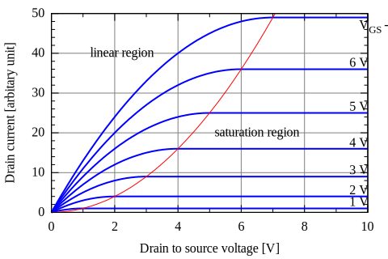
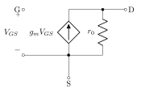
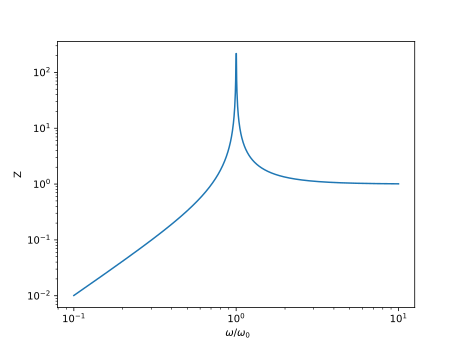
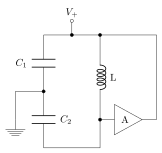

# Oxhack Analog Electronics
-------------------
## Session 5 - Resonance and Colpitts Oscillator

---

## Recap 

<strike> 
 Electrons ,  Energy & Charge ,  Voltage & Current
  Kirchoff's Laws 
   Power, Efficiency, Diodes, op amps
</strike>

 
 MOSFET, Capacitors, Inductors

## New Stuff

* Hybrid-pi MOSFET model
* Tank resonator
* Complex Impedance & Fourier series
* Colpitts Oscillator

----

## If you missed previous sessions

* Please ask for recap
* Please ask questions
* Please ask for help

## If you are a regular

* Encourage and help others
* Take turns building and debugging

----

## Usual Caveats Apply

* This isn't intended to explain the physics (but ask me if you're interested, I am a semiconductor physicist by training / background)

* This isn't comprehensive - good tutorials on the web, or read AoE

* This is complicated - don't worry if you don't "get it" all at once

* I mean it - we are really entering the swamp now!

---

## MOSFETS

**M**etal **O**xide **S**emiconductor **F**ield **E**ffect **T**ransistor

* We previously used one (2n7000) in switching mode to make the boost converter
* Today we are going to use it in "linear" mode as an amplifier

$ I\_D = K \left( \left(V\_{GS} - V\_{th} \right) - {V\_{DS}^2 \over 2} \right) $

----

## MOSFET biasing

* Need to take care about the value of $V\_{DS}$ and $V\_{GS}$

* called "biasing", principle similar for BJTs and JFETs

----

## Small signal "hybrid pi"  MOSFET model

* Assuming biasing is correct (in linear region), MOSFET looks like this

---

## Inductors & Capacitors

Capacitor (stores energy in electric field):

$I = C \times {dV \over dt}$

Inductor (stores energy in magnetic field):

$V = L \times {dI \over dt} $

---

## Resonance

* Whenever a physical system can transfer energy easily between different forms (without much loss), it has natural frequencies which it easily vibrates at

* When driven at a natural frequency, resonance occurs
* [Tacoma Bridge 1940](https://www.youtube.com/watch?v=nkXl8JJBH7E)

* [coupled metronomes](https://www.youtube.com/watch?v=_bJ1gNnlsfE)

----

## Beat Frequencies

* Not everything that looks like resonance is resonance (these pendula are uncoupled)

https://www.youtube.com/watch?v=yVkdfJ9PkRQ

* The nonlinear mixing of similar (but slightly different) frequencies is called "beating",and is also very important and interesting in electronics (but not today!)

---

## Tank Resonator
* Couple a capacitance directly to an inductance
* Energy "sloshes" between electric and magnetic storage
* Often poor Q factor (because everything has resistance)

----

$ V\_L = - V\_C $

$ i\_L = i\_C $

$ {d i \over dt} = C {d^2 v \over dt^2} $

$ {d^2 v \over dt^2} + {1 \over {LC} } v = 0 $

* If you fancy solving a differential equation, you'll find this is simple harmonic motion with frequency:

$ f = {1 \over {2\pi \sqrt{LC}}} $

----

## Demonstration

* When signal is high, system charges up through diode
* When signal is low, it is allowed to oscillate

---

## Mathematics (aside)

* When talking about AC signals, we generally use the mathematics of complex numbers, which  "automatically" takes care of adding things up including phases

* The following are equivalent electrically (some details omitted!) (see python demo)

$ V(t) = V\_0 \mathrm{sin}\left(\omega t\right)$

$V(t) = V\_0 e^{j\omega t}$

----

## Fourier Series

* Any periodic function can be written as a sum of "pure" frequencies

$ V(t) = \sum\_{n=0}^\infty  A\_n e^{j\omega\_nt} $

* This has basis physically (because infinite frequencies require infinite energy)

* The basic idea behind all frequency domain analysis

----

## Fourier Series Demo

* Square wave:

$f(t) = {4 \over \pi} \sum\_{n=1,3,5...}^\infty {1 \over n} \mathrm{sin} \left( n \omega t \over 2 \right) $

* Triangle wave:

$ f(t) = {8 \over \pi ^2} \sum\_{n=1,3,5...}^\infty { (-1)^{(n-1)/2} \over n^2} \mathrm{sin} \left(n \omega t \over 2 \right) $

---

### Integration & Differentiation

* Periodic functions can be written as Fourier Series (sum of sine waves)

* Therefore, can differentiate / integrate function by doing this to each sine wave

$ {d \over dt} Ae^{j\omega t} = j\omega \times Ae^{j\omega t} $

* So, for periodic functions of frequency $\omega$, differentiating is equivalent to multiplying by $j\omega$

---

### Impedance and Frequency Analysis

* Define **impedance** (like resistance) as:

$ Z = { V(\omega) \over I(\omega)}$

* In general, this is a complex quantity (remember this just accounts for phases naturally)

$ Z = R + j X $

* R is called "resistance", X is called "reactance"

----

### Impedance of components - Capacitor

$ I = C {dV\over dt}$ 

$ I = C \times j \omega V$

$ \therefore Z\_C = {V \over I } = {1 \over j \omega C}$

----

### Impedance of components - Inductor

$ V = L {dI \over dt} $

$ V = L \times j \omega I $

$\therefore Z\_L = {V \over I} =  { j \omega L } $

----

* Can now add up impedances like resistors to get frequency dependence of any circuit 

* e.g. parallel tank resonator:

$ {1 \over Z} = {1 \over Z\_L} + {1 \over Z\_C} $

$ Z = {1 \over j\omega C + {1 \over j \omega L} } $

$ Z = { j \omega L \over 1 - \omega^2 L C } $

----

* From this can take magnitude and phase to determine frequency response

$ |Z| = {1 \over C} {\omega \over { \omega\_0^2 - \omega^2} } $

$ \angle Z = 0 $

with 

$ \omega\_0 = {1 \over \sqrt{LC}}$

* note if you add resistance, phase shift becomes none zero!

----

---

## Barkhausen Criterion

* Given amplifier $A$ and feedback $\beta$, system **can**  oscillate (it might not!) if:

$|\beta A | = 1$  and   $\angle \beta A = 2n\pi$

---

## Colpitts Oscillator
General idea:

Look at this:
http://www.falstad.com/circuit/e-colpitts.html

----

* Tank resonator composed of $L$, $C\_1$ and $C\_2$

* need two capacitors to get the full $2\pi$ phase shift (each gives $\pi$)

* The tank circuit naturally resonates

* The amplifier restores losses due to damping

* Pretty good linearity & stability

* Can be made to extremely high frequency (10s of GHz)

----

## Colpitts Oscillator frequency

$f = {1 \over {2\pi \sqrt{LC\_1 C\_2 \over C\_1 + C\_2  } } }$

If capacitors are the same:

$f = {1 \over {2\pi \sqrt{LC \over 2}}} $

* Q factor (bandwidth) limited by parasitic resistance

---

### Practical
 **Take Care Handling the MOSFET** - the gate connection is quite ESD sensitive 

1) Build circuit from schematic

2) Experiment with changing the trim pot

3) Look at signals on MOSFET gate and drain

---

### Useful Links

https://artofelectronics.net

[https://github.com/weatherhead99/oxhack\_analog\_electronics](https://github.com/weatherhead99/oxhack\_analog\_electronics)

http://www.electronics-tutorials.ws/

http://www.falstad.com/circuit/e-index.html

